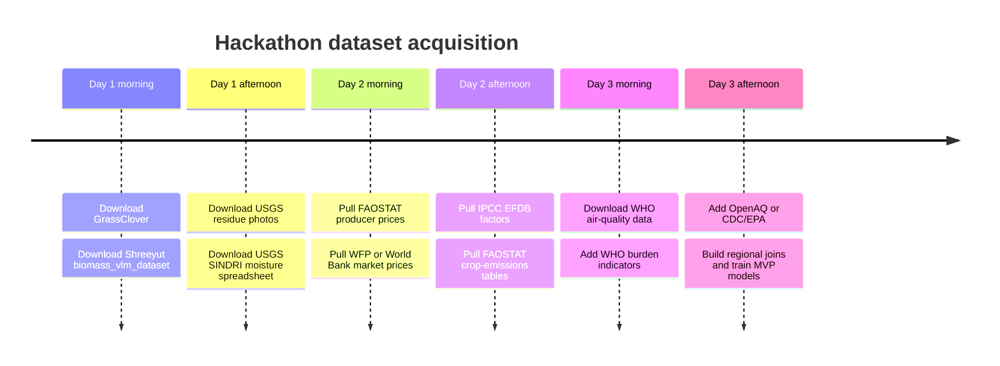

# Kaggle and Hugging Face Dataset Shortlist for AgriConnect Smart

## Executive Summary

The dataset landscape is uneven. For your five-model stack, Kaggle and Hugging Face are useful for **vision pretraining, small multimodal biomass regression, and demo-friendly market datasets**, but the **highest-confidence carbon and health/environment signals come from official public sources** published by the entity["organization","Food and Agriculture Organization","un agency"], entity["organization","World Bank","multilateral bank"], entity["organization","World Health Organization","un health agency"], entity["organization","U.S. Geological Survey","us science agency"], entity["organization","Centers for Disease Control and Prevention","us public health agency"], entity["organization","U.S. Environmental Protection Agency","us environmental regulator"], entity["organization","World Food Programme","un food aid agency"], and entity["organization","OpenAQ","air quality nonprofit"]. The strongest immediate MVP path is: **GrassClover + Shreeyut** for image/biomass signals, **FAOSTAT + WFP/World Bank** for price features, **IPCC EFDB + FAOSTAT crop-emissions** for carbon, and **WHO AQ + WHO burden indicators + OpenAQ or CDC/EPA** for risk scoring. citeturn35view0turn43view0turn12view0turn44view1turn29search5turn12view5turn30view2turn3search2turn28view0turn22view0turn27view0turn42view0turn22view3turn22view2

The biggest gap is **smartphone photos of post-harvest residues labeled by residue type for North African or MENA feedstocks**. Public datasets can get you to a strong hackathon prototype, but you should expect to add a **small custom local photo set** if you want production-relevant classes such as straw, stalks, pruning waste, olive pomace, date-palm residues, or mixed biomass bales. That is why the best public vision datasets below are mostly **transfer-learning and weak-supervision sources**, not final gold-standard residue taxonomies. citeturn35view0turn37view1turn37view0turn12view0

**Prioritized action list for immediate hackathon use**

- **Download GrassClover first** for image pretraining and biomass-composition signals: it gives 8,000 synthetic labeled images, 31,600 unlabeled real images, and 435 biomass-labeled samples under CC BY-SA. citeturn35view0turn43view0  
- **Download Shreeyut/biomass_vlm_dataset second** if you want a smaller Hugging Face-ready multimodal dataset: 1,785 rows, 1.17 GB, with image-plus-prompt-plus-label records containing NDVI, height, species, and biomass targets. citeturn12view0turn44view1turn44view3  
- **Pull FAOSTAT Producer Prices third** for baseline price regression features: annual farm-gate price coverage from 1991 for over 160 countries and about 200 commodities. citeturn29search5turn29search19  
- **Pull IPCC EFDB and FAOSTAT Emissions from Crops fourth** for a carbon MVP: these two sources are enough to build a credible deterministic emissions engine without training a separate ML model first. citeturn3search2turn28view0  
- **Pull WHO air-quality data plus WHO burden indicators, then add OpenAQ or CDC/EPA depending geography**: WHO gives global annual pollutant and attributable-death indicators; OpenAQ adds hourly station data globally; CDC/EPA gives stronger U.S. regional risk demo data. citeturn22view0turn27view0turn42view0turn22view3turn24view1  

## Prioritized Comparison Table

The table below compares the ten highest-priority datasets for a hackathon MVP. “Size” is reported as published on the dataset card or official page; if the source is query-based, I note the coverage instead of a fixed row count. Suitability is my synthesis for **your specific AgriConnect Smart use case**, not a source metric.

| Dataset | Source | Model(s) matched | Size | License | Suitability |
|---|---|---:|---|---|---:|
| GrassClover Dataset citeturn35view0turn43view0 | Official / Kaggle mirror | 1, 2 | 8,000 synthetic labeled images; 31,600 unlabeled real images; 435 biomass-labeled samples | CC BY-SA | 5 |
| Shreeyut/biomass_vlm_dataset citeturn12view0turn44view1turn44view3 | Hugging Face | 1, 2 | 1,785 rows; 1.17 GB; image + prompt + label | License should be verified on card before production use | 4 |
| Crop Residue Cover In-Field Photographs, Maryland citeturn37view1 | Official | 1, 2 | 895 photos + CSV + rasters | CC0 1.0 | 5 |
| Field datasets- SINDRI citeturn37view0 | Official | 2 | spreadsheet-scale spectral/moisture dataset | U.S. public domain | 4 |
| FAOSTAT Producer Prices - Annual citeturn29search5turn29search19 | Official | 3 | annual panel from 1991; 160+ countries; about 200 commodities | Check FAOSTAT terms for downstream redistribution | 5 |
| WFP Food Prices HF country packs, example Malawi citeturn12view5turn11view4 | Hugging Face repack of official WFP/HDX data | 3 | 52,360 rows; 18 columns; 1.32 MB | CC BY 4.0 | 4 |
| IPCC EFDB Burning in Cropland / agricultural residues citeturn3search2 | Official | 4 | query-based emission-factor records | IPCC EFDB terms | 5 |
| FAOSTAT Emissions from Crops / Crop Residues citeturn28view0 | Official | 4, 5 | annual, 1961–2023; 191 countries + 11 territories | Check FAOSTAT terms | 5 |
| WHO Ambient Air Quality Database 2022 citeturn22view0 | Official | 5 | 600+ settlements; 100+ countries; Excel/database | WHO data portal terms | 5 |
| CDC PLACES county/place/tract/ZCTA health estimates citeturn22view3turn4search17turn25search11 | Official | 5 | nationwide U.S. small-area estimates; 40 measures | U.S. government open data | 4 |

## Shortlist by Model

**Model 1 — Image classification for biomass type**

**Best primary dataset: GrassClover Dataset.**  
Provider: Aarhus University, with a convenient Kaggle mirror. URL: `https://vision.eng.au.dk/grass-clover-dataset/` and `https://www.kaggle.com/datasets/usharengaraju/grassclover-dataset`. File types: raw imagery, 16-bit Bayer PNG, JPG, plus class/instance labels. Sample count: 8,000 synthetic high-resolution labeled images, 31,600 unlabeled real images, and 15 hand-annotated segmentation images, with additional biomass-labeled pairs. Language: effectively none for pixels; English metadata and class names. License: CC BY-SA. Why it fits: it is the best public vision dataset here for **representation learning and segmentation pretraining** because it pairs canopy imagery with detailed class labels and biomass composition. Relevant fields: image pixels, class masks, instance masks, biomass labels. Mapping: use it to learn texture/color/occlusion cues for biomass-like plant matter before fine-tuning on your local residue classes. Preprocessing: patch-crop consistently, preserve color balance, and treat synthetic and real images as separate domains during training. Limitation: this is pasture and canopy data, **not post-harvest residue taxonomy**. Suggested usage: **pretraining, fine-tuning, augmentation backbone**. citeturn35view0turn43view0turn41search17

**Best official weak-supervision dataset: USGS Crop Residue Cover Maryland release.**  
Provider: USGS. URL: `https://www.usgs.gov/data/crop-residue-cover-field-photographs-worldview-3-spectral-indices-and-derived-residue-maps`. Size and files: 895 geolocated nadir photographs, a CSV table, and raster maps; the raster files range from 36 MB to 833 MB. Relevant fields include fractional crop residue cover, green vegetation, bare soil, acquisition date, latitude, longitude, WorldView-3 reflectance spectra, and spectral indices. Mapping: this is ideal for a **residue-vs-green-vs-soil** classifier or for generating weak labels for residue presence. Preprocessing: convert continuous residue percentage into bins such as none / low / medium / high; crop images around central residue area; align image, geo, and spectral rows by record ID. Quality note: strong for residue cover, weak for residue species. Suggested usage: **training small residue-presence models and creating weak labels for local phone images**. License: CC0. citeturn37view1

**Useful auxiliary Hugging Face dataset: biomass_vlm_dataset.**  
Provider: Shreeyut on Hugging Face. URL: `https://huggingface.co/datasets/Shreeyut/biomass_vlm_dataset`. Size and files: 1,785 rows, 1.17 GB, parquet-backed image-text-label data. Relevant fields are `image`, `prompt`, and `label`; the prompt encodes `Sampling_Date`, `State`, `Species`, `NDVI`, `Height_cm`, and target biomass variable. Mapping: even though the primary task is regression, the prompt gives you species tags that can seed a coarse type-classifier or a multi-task model. Preprocessing: parse the prompt into structured columns, separate target variable names, and filter to species families closest to your feedstocks. Limitation: pasture species, not residue classes directly; public card metadata is thin, so verify license terms before commercial use. Suggested usage: **fine-tuning and multimodal prototyping**. citeturn12view0turn44view1turn44view3

**Model 2 — Biomass quality estimation with visual + moisture proxies**

**Best small multimodal starter: biomass_vlm_dataset.**  
This dataset is unusually useful for model 2 because the prompts explicitly encode **NDVI and plant height** alongside image pixels and biomass targets. That makes it a strong foundation for a hackathon-quality **image + tabular regressor** that predicts quality proxies such as dry matter, green/dead fraction, or likely moisture tier. Output mapping is straightforward: image + NDVI + height → continuous dry-matter targets or discretized quality bins. Preprocessing: z-score normalize NDVI/height, standardize targets by biomass component, and run grouped splits by `Target` and `State` to reduce leakage. Suggested usage: **training or fine-tuning a multimodal regressor**. Limitation: it captures pasture biomass, not industrial agricultural residues. citeturn12view0turn11view0turn44view1

**Best moisture-specific proxy dataset: USGS Field datasets- SINDRI.**  
Provider: USGS. URL: `https://data.usgs.gov/datacatalog/data/USGS:597b279ce4b0a38ca27563b8`. File type: spreadsheet/tabular. The dataset documents **wetness conditions**, mean spectral responses for Landsat and WorldView-3 bands, tillage and wetness indices, estimated percentage of residue, and **raw water content**. That is almost exactly what you need to convert visual appearance into moisture proxies. Mapping: spectral/wetness indices → moisture class or dry/wet score; optionally join to your image model as calibration data. Preprocessing: engineer moisture bins, normalize spectral indices, and use it to calibrate a lightweight tabular head or to set targets for pseudo-labeling. Limitation: not phone images and geographically narrow. Suggested usage: **calibration, proxy labeling, and feature engineering**, especially if you later capture local photos under controlled lighting. License: U.S. public domain. citeturn37view0

**Best official visual-quality bridge: USGS Crop Residue Cover Maryland release.**  
The Maryland residue dataset adds something SINDRI does not: **actual photographs** aligned to residue fraction and spectral indices. That makes it the best public bridge between appearance and a practical biomass-quality score for your UI. For an MVP, I would derive three labels from it: `clean residue`, `mixed residue`, and `wet/green contamination likely`, based on residue %, vegetation %, and spectral moisture proxies. Suggested usage: **augmentation, weak supervision, and calibration of an image-only quality score**. citeturn37view1turn37view0

**Strong alternative when you need chemistry rather than visuals:**  
The Data in Brief dataset on **chemical quality of crop residues from European areas** is not Kaggle/HF, but it is useful if you want carbon/nitrogen ratio or decomposition-related quality features. URL: `https://www.sciencedirect.com/science/article/pii/S2352340921005114`. It provides carbon and nitrogen contents plus biochemical composition from literature-derived crop-residue data. Suggested usage: **target engineering and synthetic quality labels**, not direct image training. citeturn38view0

**Model 3 — Price estimation and regression**

**Best baseline official panel: FAOSTAT Producer Prices - Annual.**  
Provider: FAO. URL: `https://www.fao.org/faostat/en/#data/PP`. Coverage: annual data from 1991 for over 160 countries and about 200 commodities; FAOSTAT’s broader prices page also highlights annual producer-price indices across 151 countries and 191 commodities. File types: downloadable tables/bulk CSV services. Language: multilingual FAOSTAT portal with English/French/Spanish support. Mapping: country + commodity + year → producer price; for AgriConnect, convert crop prices into **residue-price priors** with crop-to-residue ratios, baling/transport cost, and local demand indicators. Preprocessing: deflate nominal prices, harmonize currencies, create lags and volatility features, and add weather or transport covariates. Limitation: primary commodities, not residue prices directly. Suggested usage: **core training data for price regression**. citeturn29search5turn29search19turn29search3

**Best Africa-friendly Hugging Face market data: WFP Food Prices country packs.**  
Example URL: `https://huggingface.co/datasets/electricsheepafrica/africa-wfp-food-prices-for-malawi`. Provider: Electric Sheep Africa repackaging the official WFP/HDX resource. Size and schema: 52,360 rows, 18 columns, dates from 1990-10-15 to 2026-03-15, 130 markets, 31 second-level admin units; license CC BY 4.0. Relevant fields: `date`, `admin1`, `admin2`, `market`, commodity identifiers, and price/value columns. Mapping: subnational market + crop + date → price series; from there you can estimate nearby residue prices or local biomass demand indices. Preprocessing: unit harmonization, rolling-window volatility, inflation adjustments, and market-cluster embeddings. Limitation: still **food** prices, not biomass-residue transactions. Suggested usage: **training and fine-tuning subnational market models**, especially for African demos. citeturn12view5turn11view4

**Best nowcasting/missing-data alternative: World Bank Real Time Food Prices.**  
URL: `https://microdata.worldbank.org/index.php/catalog/4483/`. Provider: World Bank DECDG. Coverage: 2007 to present, market-level estimates at geo-referenced market locations, updated weekly, based on WFP, FAO, national statistical offices, exchange rates, and machine-learning estimation of missing data. Relevant fields include market location, product, and modeled Open/High/Low/Close estimates. Mapping: use this when your local market panel is sparse and you need **gap-filled short-run price estimates**. Limitation: partly modeled data, so use as a covariate or nowcast layer, not sole ground truth. Suggested usage: **augmentation and forecasting covariates**. citeturn30view2

**Best macro covariate source: World Bank Pink Sheet.**  
URL: `https://www.worldbank.org/en/research/commodity-markets`. Monthly and annual XLS files are linked from the Pink Sheet page. Use it for global crop, fertilizer, and energy price covariates that can explain biomass-demand swings and transport costs. Suggested usage: **macro features, not primary labels**. citeturn30view1turn30view0

**Synthetic Hugging Face fallback for interface demos only:**  
`https://huggingface.co/datasets/electricsheepafrica/africa-synth-agriculture-commodity-market-prices-nigeria` has 180,000 rows in CSV/Parquet, MIT-licensed, but it is explicitly synthetic and should not be used for empirical market inference. It is useful for **mock UIs, stress tests, and augmentation experiments** only. citeturn13view1

**Model 4 — Carbon-impact estimation**

**Best MVP core: IPCC EFDB for agricultural residue burning.**  
URL: `https://www.ipcc-nggip.iges.or.jp/efdb/find_ef.php?ipcc_code=3.C.1.b&ipcc_level=3`. Provider: IPCC EFDB. The public agricultural-residues page exposes default factors such as CO2 at **1515 ± 177 g/kg dry matter**, CH4 at **2.7 g/kg**, N2O at **0.07 g/kg**, and NOx at **2.5 ± 1.0 g/kg** for agricultural residues. Mapping: dry biomass mass + scenario (`burned`, `sold`, `composted`, `used for bioenergy`) → emissions estimate. Preprocessing: convert wet mass to dry matter, standardize units, and separate direct combustion from avoided-emissions scenarios. Limitation: defaults are generic, not crop- and locality-specific. Suggested usage: **primary rules engine for carbon estimation in the MVP**. citeturn3search2

**Best activity-data companion: FAOSTAT Emissions from Crops / Crop Residues.**  
URL: `https://files-faostat.fao.org/internal/GCE/GCE_e.pdf` and the FAOSTAT emissions portal. Coverage: annual data for 1961–2023, global coverage, 191 countries and 11 territories, multilingual, with crop residues, burning of crop residues, rice cultivation, and fertilizer emissions. Relevant fields include harvested area, biomass burned, nitrogen in residues, CH4/N2O emissions, and crop categories. Mapping: this is ideal for **country/regional priors, baseline factors, and validation**, especially when you estimate avoided burning or cluster regions by typical residue practices. Preprocessing: extract crop-country-year series, join with local crop-production estimates, then apply project-specific burning/collection assumptions. Limitation: country-level annual aggregates are too coarse for transactional carbon credits without local activity logs. Suggested usage: **training covariates, calibration, and benchmarking**, not sole event-level labels. citeturn28view0

**Best regional burning-shock add-on: CAMS GFAS.**  
URL: `https://ads.atmosphere.copernicus.eu/datasets/cams-global-fire-emissions-gfas?tab=documentation`. Provider: Copernicus/ECMWF. File types: netCDF or GRIB. The dataset provides global biomass-burning emissions from fire radiative power and is licensed CC BY. Mapping: use it to detect or quantify **regional burning spikes**, especially when you want a before/after comparison for “burning vs valorization.” Limitation: it is fire-emissions data, not residue-valorization economics; it complements, rather than replaces, EFDB/FAOSTAT. Suggested usage: **regional validation and event overlay**. citeturn40search3turn40search7turn40search17

**Useful chemistry add-on:**  
The ScienceDirect crop-residue chemistry dataset gives carbon, nitrogen, C:N ratio, and biochemical composition from European residues, which can sharpen your “quality-to-carbon” logic if you build feedstock-specific emission or decomposition scenarios. Suggested usage: **synthetic data and parameter priors**. citeturn38view0

**Model 5 — Regional health and environment risk scoring**

**Best global pollution baseline: WHO Ambient Air Quality Database.**  
URL: `https://www.who.int/data/gho/data/themes/air-pollution/who-air-quality-database/2022`. Coverage: 600+ human settlements in 100+ countries, with annual mean NO2, PM10, and PM2.5 intended to represent city/town-level averages; Excel download is provided from the page. Mapping: settlement/city pollutant averages → regional exposure baseline. Preprocessing: geocode settlements, aggregate to governorate/province, and convert to standardized z-scores or guideline exceedance indicators. Limitation: annual averages only; not suitable for acute-event response on its own. Suggested usage: **baseline scoring and calibration**. citeturn22view0

**Best global health-outcome layer: WHO ambient-air-pollution attributable deaths.**  
URL: `https://www.who.int/data/gho/data/indicators/indicator-details/GHO/ambient-air-pollution-attributable-deaths`. Coverage includes country/group by year, sex, age group, and disease cause. Mapping: pollution/exposure aggregates → attributable-burden calibration target. This is a good target for a **regional risk scoring model** when you cannot get local clinic or hospital data. Limitation: country-level burden is coarser than city-level exposure and is epidemiological rather than clinical. Suggested usage: **target engineering and benchmarking**. citeturn27view0turn27view1

**Best U.S. demo pair: CDC PLACES + EPA AirData.**  
URLs: `https://www.cdc.gov/places/index.html` and `https://aqs.epa.gov/aqsweb/airdata/download_files.html`. PLACES provides model-based estimates at county, place, census tract, and ZCTA levels for **40 measures**, while EPA AirData offers large daily pollutant files; for example, daily PM2.5 FRM/FEM records are listed at **738,478 rows for 2024** and **848,083 rows for 2023** on the download page. Mapping: EPA daily PM2.5 / PM10 / ozone series + PLACES asthma or respiratory proxies → regional risk score. Limitation: best for a U.S. demo, not directly portable globally. Suggested usage: **high-quality regional scoring prototype** if your judges care more about methodology than geography. citeturn22view3turn25search11turn24view1

**Best global time-series alternative: OpenAQ.**  
URL: `https://openaq.org/` and docs `https://docs.openaq.org`. OpenAQ aggregates global air-quality data from hundreds of sources, updates hourly, exposes an API, and offers daily gzipped CSV archives plus S3 access. Mapping: station-level hourly pollution time series → rolling exposure features for regional scores. Limitation: provider licenses vary by source, and health outcome labels are not included. Suggested usage: **feature generation and temporal exposure tracking**. citeturn22view1turn42view0

**Synthetic Hugging Face fallback for demo-only health modeling:**  
`https://huggingface.co/datasets/electricsheepafrica/air-quality-respiratory` contains **30,000 synthetic records** connecting air quality and respiratory outcomes. It is explicitly synthetic and should not be used for empirical policy or clinical claims. Suggested usage: **UI prototypes and augmentation experiments only**. citeturn13view0

## Recommended Combination Strategy

For the **fastest credible MVP**, I would not train five completely independent models. I would build **three shared data pipelines** instead. First, a **vision pipeline** using GrassClover, the USGS residue photographs, and the small Hugging Face biomass VLM dataset; second, a **market/tabular pipeline** using FAOSTAT producer prices plus WFP or World Bank market data; third, a **rules-plus-risk pipeline** using IPCC EFDB + FAOSTAT emissions for carbon and WHO/OpenAQ/CDC-EPA for health-environment risk. This reduces engineering overhead and keeps the valuation logic explainable for judges. citeturn43view0turn37view1turn12view0turn29search5turn12view5turn30view2turn3search2turn28view0turn22view0turn42view0turn22view3turn22view2

The best merge strategy is: **GrassClover for visual backbone pretraining**, **biomass_vlm_dataset for image-plus-metadata regression**, then **local smartphone photos** for the final classifier head. For pricing, combine **FAOSTAT annual farm-gate prices** with **WFP subnational market prices** and optionally **World Bank RTP/Pink Sheet** macro variables. For carbon, start with a **deterministic calculator** before you attempt ML. For health scoring, use **WHO annual AQ + WHO attributable burden** for global baselines, then layer in **OpenAQ** or **EPA/CDC** time series where available. citeturn35view0turn12view0turn29search5turn12view5turn30view2turn30view1turn3search2turn28view0turn22view0turn27view0turn42view0turn22view3turn24view1

For synthetic augmentation, the only safe recommendation is to use it as **augmentation or demo scaffolding**, never as final evidence. The Electric Sheep Africa synthetic market and respiratory datasets are fine for interface testing, schema design, or adversarial validation, but not for real-world claims. For transfer learning, use **self-supervised or contrastive pretraining** on unlabeled real imagery first, then fine-tune lightly on your small local residue set. citeturn13view1turn13view0turn35view0turn43view0

For a hackathon MVP, my practical minimums are: **500–1,200 local residue photos** total for model 1 with transfer learning; **300–800 labeled samples** for quality estimation if you reduce the target to 3–5 ordinal classes; **2,000+ market records** or about **24 months × 20 markets × a few commodities** for price regression; **no ML requirement** for carbon if you use EFDB + FAOSTAT rules; and **hundreds of regions or at least 12–36 monthly observations per region** for risk scoring. Those thresholds are design heuristics rather than published source requirements, but they fit the scale and coverage of the public datasets above.

## Acquisition Timeline

The acquisition order below follows the practical friction of the sources: direct-download/open-card datasets first, then market panels, then carbon/risk layers that require more joins.



This sequence is practical because GrassClover and the Hugging Face biomass dataset are immediately usable for experimentation, while the official market, carbon, and health panels are more valuable once you already have your data schema fixed. The WHO, OpenAQ, CDC, and EPA layers should come last because the hardest work is usually the **geographic join and temporal harmonization**, not the download itself. citeturn43view0turn12view0turn37view1turn37view0turn29search5turn12view5turn30view2turn3search2turn28view0turn22view0turn27view0turn42view0turn22view3turn22view2

## Loading Examples and Links

The following links are the highest-value starting points. I am putting them in code format so you can copy them directly.

```text
GrassClover official:
https://vision.eng.au.dk/grass-clover-dataset/

GrassClover Kaggle mirror:
https://www.kaggle.com/datasets/usharengaraju/grassclover-dataset

Hugging Face biomass VLM:
https://huggingface.co/datasets/Shreeyut/biomass_vlm_dataset

USGS residue-photo release:
https://www.usgs.gov/data/crop-residue-cover-field-photographs-worldview-3-spectral-indices-and-derived-residue-maps

USGS SINDRI:
https://data.usgs.gov/datacatalog/data/USGS:597b279ce4b0a38ca27563b8

FAOSTAT producer prices:
https://www.fao.org/faostat/en/#data/PP

FAOSTAT bulk service index:
https://fenixservices.fao.org/faostat/static/bulkdownloads/datasets_E.json

HF WFP Malawi prices:
https://huggingface.co/datasets/electricsheepafrica/africa-wfp-food-prices-for-malawi

World Bank real-time food prices:
https://microdata.worldbank.org/index.php/catalog/4483/

World Bank commodity prices:
https://www.worldbank.org/en/research/commodity-markets

IPCC EFDB burning in cropland:
https://www.ipcc-nggip.iges.or.jp/efdb/find_ef.php?ipcc_code=3.C.1.b&ipcc_level=3

FAOSTAT crop-emissions note:
https://files-faostat.fao.org/internal/GCE/GCE_e.pdf

WHO ambient air quality database:
https://www.who.int/data/gho/data/themes/air-pollution/who-air-quality-database/2022

WHO ambient-air-pollution attributable deaths:
https://www.who.int/data/gho/data/indicators/indicator-details/GHO/ambient-air-pollution-attributable-deaths

OpenAQ:
https://openaq.org/
https://docs.openaq.org

CDC PLACES:
https://www.cdc.gov/places/index.html

EPA AirData:
https://aqs.epa.gov/aqsweb/airdata/download_files.html

CAMS GFAS:
https://ads.atmosphere.copernicus.eu/datasets/cams-global-fire-emissions-gfas?tab=documentation
```

These URLs come directly from the official pages or dataset cards referenced above, plus the Hugging Face/Kaggle dataset cards and official platform mirrors. citeturn43view0turn12view0turn37view1turn37view0turn29search5turn12view5turn30view2turn30view1turn3search2turn28view0turn22view0turn27view0turn42view0turn22view3turn22view2turn40search3

```python
# Hugging Face loaders
from datasets import load_dataset

biomass = load_dataset("Shreeyut/biomass_vlm_dataset")
wfp_malawi = load_dataset("electricsheepafrica/africa-wfp-food-prices-for-malawi")

print(biomass["train"].column_names)
print(wfp_malawi["train"].column_names)
```

```python
# Local-file pandas loaders after download
import pandas as pd

faostat_prices = pd.read_csv("ProducerPrices.csv")
usgs_residue = pd.read_csv(
    "fractional_crop_residue_gv_soil_lon_lat_photo_v5_FINAL_with_reflectance_indices.csv"
)
who_aq = pd.read_excel("who_air_quality_database_2022.xlsx")
```

```python
# Simple feature parsing for the biomass VLM dataset
import re
from datasets import load_dataset
import pandas as pd

ds = load_dataset("Shreeyut/biomass_vlm_dataset", split="train")
df = ds.to_pandas()

pattern = re.compile(
    r"Sampling_Date:\s*(?P<date>[^;]+);\s*State:\s*(?P<state>[^;]+);\s*Species:\s*(?P<species>[^;]+);\s*NDVI:\s*(?P<ndvi>[^;]+);\s*Height_cm:\s*(?P<height>[^;]+);\s*Target:\s*(?P<target>[^.]+)"
)

parsed = df["prompt"].str.extract(pattern)
parsed["ndvi"] = parsed["ndvi"].astype(float)
parsed["height"] = parsed["height"].astype(float)
df = pd.concat([df, parsed], axis=1)
```

```python
# OpenAQ API starter
import requests
import pandas as pd

url = "https://api.openaq.org/v3/locations"
params = {"countries_id": 788, "limit": 100}  # example country filter
resp = requests.get(url, params=params, timeout=30)
data = resp.json()
locations = pd.json_normalize(data.get("results", []))
print(locations.head())
```

The loader patterns above match the dataset structures exposed on the Hugging Face cards and official download pages: image-plus-structured-prompt for the biomass VLM dataset, parquet/CSV for WFP-derived market data, CSV for the USGS residue release, Excel for WHO AQ, and API access for OpenAQ. citeturn12view0turn12view5turn37view1turn22view0turn42view0

## Open Questions and Limitations

The main unresolved issue is **license clarity and public-card completeness** for some community datasets, particularly smaller Hugging Face or Kaggle mirrors. Where the public card did not clearly surface a license or exact data specification, I flagged it rather than guessing. For anything beyond a hackathon, verify license terms before shipping. citeturn12view0turn44view1

The second limitation is **task mismatch**. The public datasets that are easiest to get are often about **pasture biomass, crop-residue cover, market food prices, or national burden indicators**, not the exact end-task of “farmer photographs a pile of residues and your app returns type, quality, price, carbon value, and health-risk context.” That means the most realistic production path is **transfer learning plus a small local labeled dataset**. The good news is that the public resources above are strong enough to make that local dataset much smaller. citeturn35view0turn37view1turn29search5turn27view0